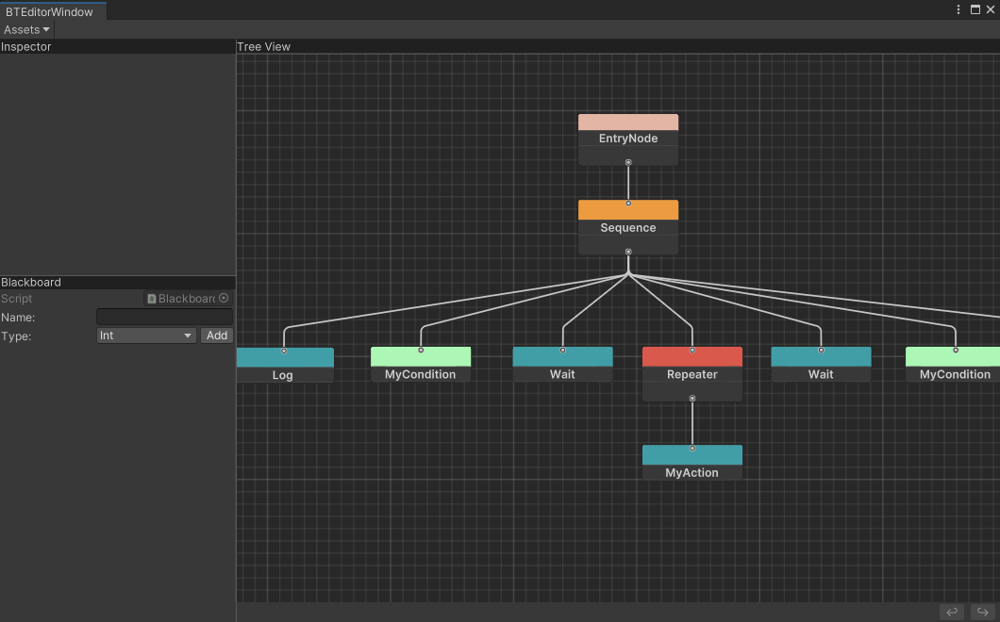
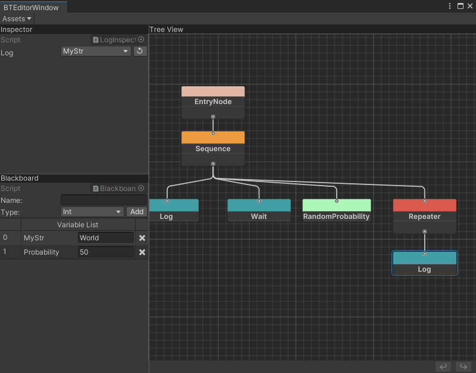
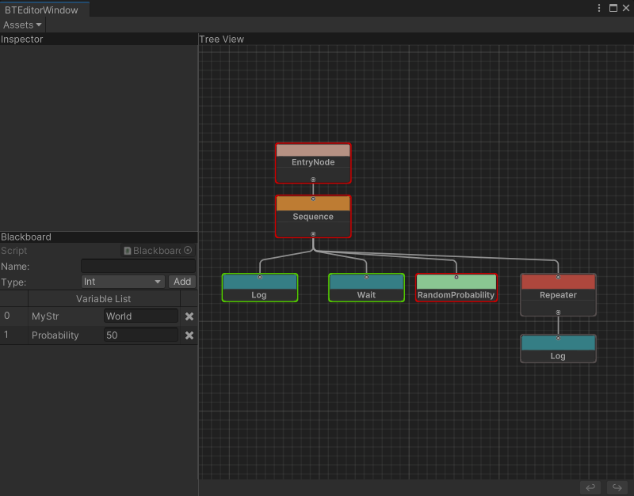

# BehaviorTreeEditor
## 目录结构
- BTCore
    - Data：BT数据导出目录，主要为json格式。
    - Editor：编辑器部分，引用到Odin插件做编辑处理。
    - Runtime：注意Runtime部分需要支持脱离Unity环境运行，因此不能引用到任何Unity相关API和特性，只用到了一个第三方json序列化库**Newtonsoft.Json**方便序列化处理数据，你也可以替换为其他序列化保存方式。
    - Runtime.Unity：需要引用Unity部分的代码请放入这个目录，目前暂未实现主体逻辑，待扩展。
## 使用说明
基于UIToolkit实现行为树数据编辑，支持赋值粘贴，撤销回退，运行时预览等操作。当需要支持BT.Runtime部分脱离Unity环境运行，用于服务端或者帧同步框架上时，可以直接拷贝源码，或者导出BTRuntime.dll到外部工程，引用上Newtonsoft.Json即可。节点的Inspector面板和黑板面板都是用Odin插件实现编辑效果，支持节点变量绑定黑板数据，实现逻辑可以看BTCore.Editor部分代码。
## 外部工程使用说明

打开Scenes/2. ExternalNode.unity场景，里面有提供一个简单的示例Demo，相关脚本在Examples/ExternalNode目录下。提供了Condition，Action外部节点类型扩展，一般来说外部工程的代码不放到Unity里面，无法识别具体的类型，Unity侧提供了ExternalCondition，ExternalAction两个节点做编辑占位处理。在每个节点Inspector上有对应的映射字段TypeName便于创建对应外部类型，Properties字段方便向外部传递数据。运行时会将占位节点替换为具体映射类型，然后重建树节点之间的连接关系。
## 效果图

## 已知问题
- 调整了节点之间连线的关系存储，目前撤销，恢复好像还有点小问题，不过不影响主要功能使用，等后面有时间再修复吧。
## 参考
- https://github.com/thekiwicoder0/UnityBehaviourTreeEditor
