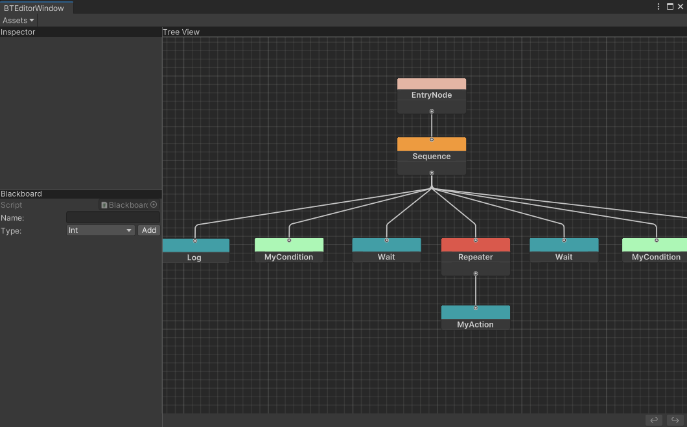

# BehaviorTreeEditor

#### 目录结构

- BTCore
  - Data：BT数据导出目录，数据序列化保存格式分为Json、MemoryPack两种可自行选择
  - Editor：编辑器部分，引用到Odin插件做编辑处理
  - Runtime：注意Runtime部分需要支持脱离Unity环境运行，因此不能引用到任何Unity相关API和特性，用到了json序列化库**Newtonsoft.Json**和**MemoryPack**二进制存储方便序列化处理数据，你也可以替换为其他序列化保存方式
  - Runtime.Unity：需要引用Unity部分的代码请放入这个目录，目前暂未实现主体逻辑，待扩展

#### 使用说明

若只在Unity里面用，正常使用即可，挂载上BehaviorTree组件，或者其他反序列化BT数据后做Tick操作即可。当需要支持BT.Runtime部分脱离Unity环境运行，用于服务端或者帧同步框架上时，可以直接拷贝源码，或者独立生成BTRuntime.dll到外部工程，引用上**Newtonsoft.Json**和**MemoryPack**即可。节点的Inspector面板和黑板面板都是用Odin插件实现编辑效果，支持节点变量绑定黑板数据，实现逻辑可以看BTCore.Editor部分代码

#### 功能实现
- [x] 行为树节点数据编辑，黑板功能实现
- [x] 支持节点赋值粘贴、撤销回退，运行时预览状态
- [x] 右键实现节点分类搜索框、选中自动生成对应节点
- [x] 实现组合节点3种中断机制，Self、LowerPriority、Both
- [x] 增加对单个节点的注释，新增节点Group、StickyNotes(版本需2020往上)
- [x] 支持Json、MemoryPack两种格式序列化/反序列化
#### 注意事项
- 注意只有节点数据支持撤销、重做， Group、StickNote节点不支持。右上角新增设置按钮，可进行序列化方式的切换
- 使用MemoryPack进行数据序列化的时候，请注意抽象类/接口和他们的派生类分布在不同的程序集，为了实现正确的序列化、反序列化，需要手动进行注册，开始运行时调用一次即可，参考**MemoryPackDynamicUnionRegister**这个类
#### 效果图

Group、StickNote在节点搜索框分类的Others里面。注意按住Shift建后，再点击Group里面的节点才能拖拽出组！
#### 节点中断机制

增加了组合节点的中断功能，如图所示Sequence设置了LowPriority，当按钮按下时，能够打断右边的持续性Action节点运行，整体思路可参考BehaviorDesigner
#### 外部工程使用说明

打开Scenes/2. ExternalNode.unity场景，里面有提供一个简单的示例Demo，相关脚本在Examples/ExternalNode目录下。提供了Condition，Action外部节点类型扩展，一般来说外部工程的代码不放到Unity里面，无法识别具体的类型，Unity侧提供了ExternalCondition，ExternalAction两个节点做编辑占位处理。在每个节点Inspector上有对应的映射字段TypeName便于创建对应外部类型，Properties字段方便向外部传递数据。运行时会将占位节点替换为具体映射类型，然后重建树节点之间的连接关系

#### 参考

- https://github.com/thekiwicoder0/UnityBehaviourTreeEditor
